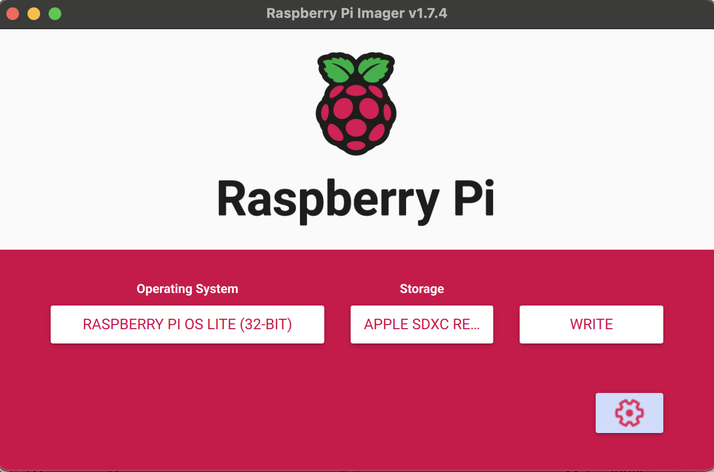

# MemoriLens: Design and Implementation of a Lifelog Camera using Raspberry Pi Zero

This is a step-by-step guide to set up MemoriLens, a Raspberry Pi Zero as a time-lapse camera and automatically upload the images to a server. 

## Requirements

- Raspberry Pi Zero
- Camera module (2, 3) and Camera Adapter for Pi Zero
- SD Card (minimum 8 GB)
- HDMI to mini HDMI cable, USB to micro USB cable, micro USB to USB cable
- WiFi Network - 2.4GHz
- SSH Access to a remote server
- Keyboard and Monitor (if not set up through SSH)

## Installation

1. Load Raspberry Pi OS lite 32 bit to the SD card using Raspberry Pi Imager: https://www.raspberrypi.com/software/
    - Config the SSH and Wifi at the UI

    
    


2. First boot with Raspberry Pi Zero and set it up as shown in image below.

    


3. Login with the username `pi` and password `pass1234` (Note: the password is configed on step 1)
4. Configure WiFi:
```
sudo raspi-config
```
Select `System Options` -> `Wireless LAN` and configure your WiFi network.

5. Update software:
```
sudo apt update
sudo apt full-upgrade
```
6. Create a directory for saving images:
```
mkdir webcam
```
7. Create a script for time-lapse capture:
```
nano webcam.sh
```
Add the following code, reference: https://docs.arducam.com/Raspberry-Pi-Camera/Native-camera/Libcamera-User-Guide/
```
#!/bin/bash
script camera_log.txt
yearmonth=$(date “+%Y%m”)
day=$(date “+%d”)
cd /home/pi/webcam
mkdir -p $yearmonth
cd $yearmonth
mkdir -p $day
cd $day
libcamera-still  -n -t 2000 –width 2560 –height 1440 –rotation 180 –exposure sport –autofocus-speed fast –autofocus-range full -o $(date “+%Y%m%d_%H%M%S”).jpg
sleep 28
libcamera-still  -n -t 2000 –width 2560 –height 1440 –rotation 180 –exposure sport –autofocus-speed fast –autofocus-range full -o $(date “+%Y%m%d_%H%M%S”).jpg
exit
```
8. Grant privilege to the file:
```
chmod +x webcam.sh 
```
9. Create a schedule for running the file:
```
crontab -e
```
Add the following line:
```
* * * * * /home/pi/webcam.sh
```
This will run the script every two minutes.

10. Create a sync job to upload data to a server:
```
ssh user@server_ip
ssh-keygen
cat .ssh/id_rsa.pub | ssh user@server_ip “cat >> .ssh/authorized_keys”
crontab -e
```
Add the following line:
```
* * * * * rsync -avz /home/pi/webcam/* user@server_ip:/path/to/destination/
```

11. Turn on auto-login:
```
sudo raspi-config
```
Select `System options` > `Boot / Auto login` and turn off the option for auto login in console by choose B2: Console Autologin

12. Configure restart for failed jobs:
```
nano check.sh
```
Add the following code:
```
if grep -q “ERROR” camera_log.txt; then sudo reboot; fi
if grep -q “error” camera_log.txt; then sudo reboot; fi

sudo chmod +x check.sh
crontab -e
```
Add the following line:
```
* * * * * sudo /home/pi/check.sh
```
This will run the check script every minute.

13. Create a log file:
```
*/2 * * * * touch /home/pi/camera_log.txt
```
This will create an empty log file every two minutes.

## Contributing

Feel free to contribute to this project by submitting issues or pull requests.
